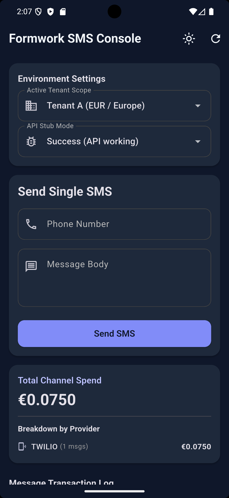
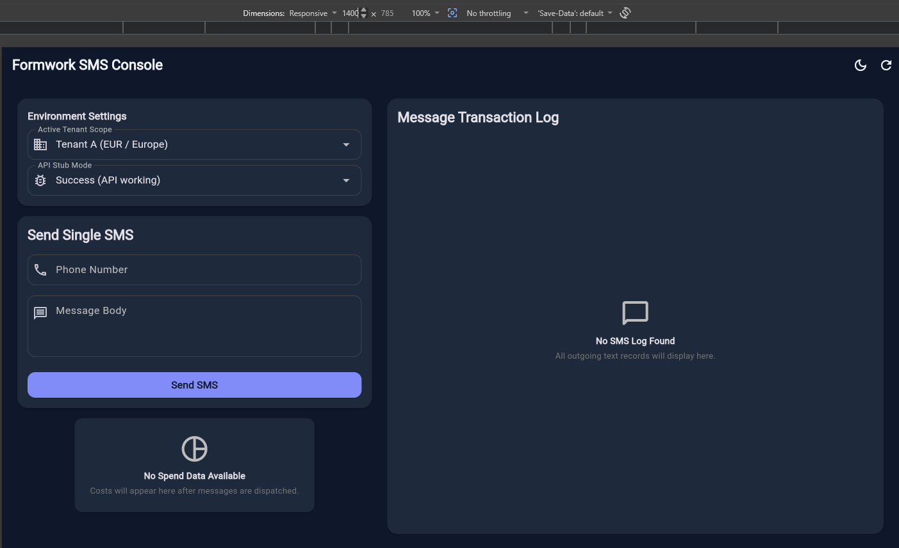

# Formwork SMS Console

A production-grade Flutter implementation for multi-tenant SMS management, rebuilt from the ground up to solve critical security, financial, and architectural flaws in the legacy AI-generated codebase.

## 🚀 Project Overview
This application serves as a dashboard for businesses to:
- Send SMS messages to international recipients.
- Monitor real-time cost breakdowns across multiple providers.
- Audit a paginated history of sent messages with masked PII.
- Manage multiple tenants with strict data isolation.

## 🏗️ Architecture
The project follows **Clean Architecture** to ensure testability and maintainability:
- **Domain Layer**: Contains pure business logic, entity definitions (`SmsMessage`, `Money`), and abstract repository definitions. It has zero dependencies on external libraries or the UI.
- **Data Layer**: Implements repository interfaces, handles HTTP communication, and maps backend error codes to semantic domain exceptions.
- **Presentation Layer**: Uses the **BLoC (Cubit)** pattern. UI is a pure function of state. Widgets are divided into smart "Pages" and reusable "Components".

## 📁 Folder Structure
```text
lib/
├──core
    ├──theme/       # Design system (Colors, Spacing, Typography)
    ├──utils/       # Core utilities (Precision Money, Formatting)
├── data/           # Repository implementations & Data Transfer Objects (DTOs)
├── domain/         # Pure entities, repository interfaces, and business logic
├── presentation/   # BLoC/Cubit state management and UI components

```

## 📦 Packages Used
- `flutter_bloc`: For predictable state management.
- `http`: For robust API interaction.
- `intl`: For localized date and currency formatting.
- `flutter_test`: Comprehensive testing suite.

## 🛠️ How to Run
1.  Ensure Flutter is installed (`flutter doctor`).
2.  Clone the repository.
3.  Run `flutter pub get`.
4.  Launch the app: `flutter run`.
    - *Note: The app defaults to a `FakeSmsRepository` for easy evaluation without a live backend.*

## 🧪 How to Test
- **Unit & Widget Tests**: `flutter test`
- **Golden Tests**: `flutter test test/widget/golden_test.dart`
- **Update Goldens**: `flutter test --update-goldens`

## 💻 Supported Platforms & Responsive Behavior
- **Android & iOS**: Full support with adaptive 360px+ layouts. 
- 
- **Web & Desktop (macOS/Windows/Linux)**: Optimized wide-screen layout (1400px+) using a grid system to balance whitespace and information density.



## ⚖️ Trade-offs & Engineering Judgment
- **State Management**: Chose BLoC/Cubit over Provider/Riverpod for stricter state boundaries and easier tenant isolation.
- **Money Handling**: Implemented a custom `Money` class instead of using `double` or external heavy libraries to keep the core domain lightweight but 100% precise.
- **Navigation**: Used basic Flutter Navigator as the app is currently a single-screen dashboard.

## ✂️ What was intentionally cut (6–8 hour box)
- **Local Database (Persistence)**: Message history is in-memory only.
- **Bulk SMS UI**: While the repository supports bulk sends, the UI focus was on a polished single-send and audit experience.
- **Deep Localization**: Currency symbols are dynamic, but UI strings are currently static.

## 🔮 Future Improvements
- **Offline Sync**: Adding a local cache (Hive) for message logs.
- **Real-time Status**: Integrating WebSockets or Polling to transition message statuses (ACCEPTED -> SENT -> DELIVERED) automatically.
- **Auth Flow**: Implementing a proper login screen and Secure Storage for JWT tokens.
